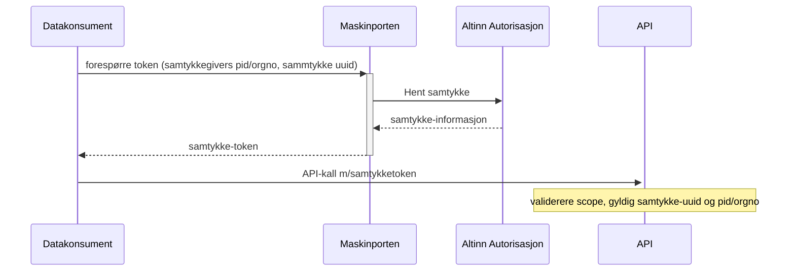

Funksjonaliteten lar en datakonsument hente ut og inkludere et samtykke i et Maskinporten accesstoken. Tjenesteeier må definere samtykkeressurs, og samtykke må gis av sluttbruker. Samtykke kan også gis på vegne av en organisasjon av en bruker med nødvendige rettigheter.
Den overordna funksjonalitetet er beskrevet på [Samarbeidsportalen](https://samarbeid.digdir.no/altinn/samtykketjenesten/2337)

## Status

Funksjonaliteten er lansert i 2025.  

## Bakgrunn

Samtykkeløsningen er utformet med hensikt om å oppfylle [datatilsynets krav til samtykke for å behandle personopplysninger.](https://www.datatilsynet.no/rettigheter-og-plikter/virksomhetenes-plikter/behandlingsgrunnlag/veileder-om-behandlingsgrunnlag/?id=176)


#### Hva inneholder et samtykke-token ?

Rent teknisk vil maskinporten spørre Altinn 3 om et gitt samtykke eksisterer. Samtykket er definert av Tjenesteeier og er identifisert med en uuid, det må også oppgis hvem som har gitt samtykket. (En org/person) Samtykket må være gitt til den organisasjonen som eier maskinporten klienten. 
Ved bruk av delegerte scopes i maskinporten, må samtykket være gitt til den som har delegert scopet til gitt maskinporten klient.

#### For API-tilbyder/Tjenesteeier

For å kunne bruke et samtykke-token til tilgangstyring må API-tilbyder opprette et samtykke i Altinn 3, og dette må sluttbruker så akseptere. Mer informasjon i Altinn sin dokumentasjon av [samtykke for tjenesteier.](https://docs.altinn.studio/nb/authorization/guides/resource-owner/consent/)
Det er viktig at tjenesteeier validerer id og from/to claims for samtykket i tokenet.

## Grensesnittsdefinisjon

Funksjonaliteten er basert på Oauth2-utvidelesen for [fin-granulert autorisasjon (Rich Authorization Requests, RAR)](https://datatracker.ietf.org/doc/rfc9396/), der vi har definert en ny type `urn:altinn:consent` for samtykke-mønsteret.

Konsument ber om å få et token for en påstått kunde ved å oppgi en uuid for et samtykke, samt kundens personnummer eller organisasjonsnummer, og dersom et samtykke foreligger i Altinn, vil det returneres et Maskinporten-token med samtykke-identifikatorer som konsument kan bruke mot API-tilbyder. 



### Forespørsel

En datakonsument ber om å få samtykke-token for å få tilgang til persondata som krever et samtykke. Dette er gjort med en RAR-forespørsel av type `urn:altinn:consent` med samtykkets uuid, i [JWT-grantet](maskinporten_protocol_jwtgrant):

Datamodellen for request ser slik ut:

| claim | kardinalitet | beskrivelse |
| ----- | ------------ | ----------- |
| `type`| Påkrevd | Alltid `urn:altinn:consent` |
| `id` | Påkrevd | Organisasjonsidentifikator i ISO6523-format på eier av systembrukeren (leverandørens kunde) |
| `from` | Påkrevd | Orgno eller pid på den som har gitt samtykket. Gis på format `urn:altinn:person:identifier-no:12345678910` for pid eller `urn:altinn:organization:identifier-no:123456789` for org |


*Forenklet eksempel på JWT-grant i token-request*
```
{
  "aud": "https://maskinporten.no",
  "scope": "api-tilbyders-scope",
  "iss":   "my_client_id",

  "authorization_details": [ {
    "from" : "urn:altinn:person:identifier-no:05848998356",
    "id" : "0a7d59f8-8c62-4312-9fb4-62456664c96f",
    "type" : "urn:altinn:consent"
  }],
  ...
}
```

Merk 1: man kan kun spørre på et samtykke om gangen.  
Merk 2: grantet må også alltid forespørre et eller flere Oauth2 scopes.

### Respons

Tokenet vil innehold detaljer om gitt samtykke dersom det eksisterer:

Datamodellen for respons ser slik ut:

| claim | beskrivelse |
| ----- |  ----------- |
| `type`|  Alltid `urn:altinn:consent` |
| `id` | Organisasjonsidentifikator i ISO6523-format på eier av systembrukeren (leverandørens kunde) |
| `from` | Orgno eller pid på den som har gitt samtykket. Gis på format `urn:altinn:person:identifier-no:12345678910` for pid eller `urn:altinn:organization:identifier-no:123456789` for org |
| `to` | Organisasjonsidentifikator i ISO6523-format på organisasjonen samtykket er gitt til |
| `consented` | Tidsstempel på ISO 8601 format for da samtykket vart gitt |
| `validTo` | Tidsstempel på ISO 8601 format for tidspunktet samtykket er gyldig til  |
| `consentRights` | Liste over rettigheter gitt i samtykket, inneholder alltid `action`, `resource`. Inneholder `metadata` dersom samtykket inneholder det |


Merk at `externalRef` ikke er returnert, det brukes kun for å identifisere rett systembruker i de tilfeller der det er flere kandidater.
Leverandøren sitt organisasjonsnummer finner du i claimet `consumer` som vanlig.

*Forenklet eksempel på access token:*
```
{
  "iss":          "https://maskinporten.no",
  "scope":        "api-tilbyders-scope",
  "iss":          "my_client_id",
  
  "authorization_details" : [ {
    "type" : "urn:altinn:consent",
    "id" : "0a7d59f8-8c62-4312-9fb4-62456664c96f",
    "from" : "urn:altinn:person:identifier-no:05848998356",
    "to" : {
      "authority" : "iso6523-actorid-upis",
      "ID" : "0192:314330897"
    },
    "consented" : "2025-11-14T10:48:55.759557+00:00",
    "validTo" : "2028-01-01T14:30:00+00:00",
    "consentRights" : [ {
      "action" : [ "consent" ],
      "resource" : [ {
        "type" : "urn:altinn:resource",
        "value" : "enkelt-samtykke"
      } ],
      "metadata" : {
        "simpletag" : "test samtykke"
      }
    } ]
  }],
  "consumer" : {
      "authority" : "iso6523-actorid-upis",
      "ID" : "0192:314330897"
    },
  "exp": 1766129337,
  "iat": 1766129217,
  "jti": "kZSxjE6uwlshpkjITzHncDtb_Vjph-1d53KUcVNerqU"
  ...
}
```


## Oppsett

Datakonsument/tjenesteleverandør må først opprette en vanlig Maskinporten-integrasjon gjennom selvbetjening på [Samarbeidsportalen](https://samarbeid.digdir.no).  Klienten må ha tilgang til å knytte Api-tilbyder/tjenesteeier sitt scope til klienten. Se gjerne nærmere på [delegering](https://docs.digdir.no/docs/Maskinporten/maskinporten_func_delegering.html) om tilgang ikke skal gies direkte til eier av klient. 

Tjenesteeier må [opprette en samtykkeressurs i altinn](https://docs.altinn.studio/nb/authorization/guides/resource-owner/consent/) som sluttbruker (org/pid) må logge inn og akseptere. Ved oppretting får Tjenesteeier en uuid som identifiserer samtykket. Dette er den uuid som er henvist til ovenfor, og som må brukes for at sluttbruker skal kunne gi samtykke, og for å etterspørre samtykketoken i maskinporten.

Se også Altinn sin guide - [Kom igang med samtykke](https://docs.altinn.studio/nb/authorization/getting-started/consent/) for mer detaljer rundt oppretting av samtykkeressurs
