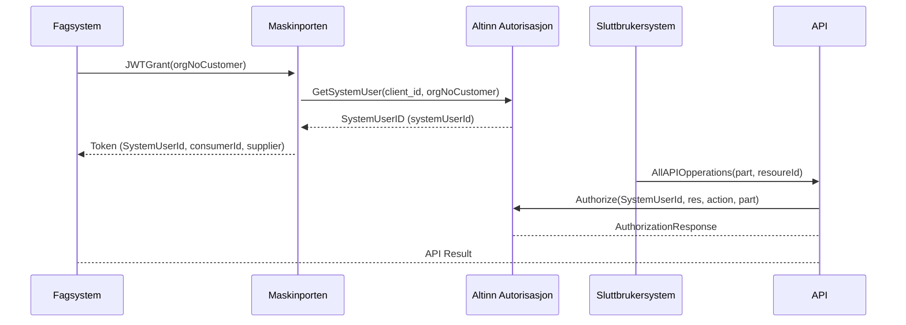

**Alt 1:**
Funksjonaliteten lar en virksomhet delegere avgrensede rettigheter til et fagsystem som de benytter fra en systemleverandør.

**Alt 2:**
Funksjonaliteten lar leverandører definere sine Maskinporten-integrasjoner som fagsystemer i Altinn, som leverandørens kunder i sin tur kan tildele bare de rettighetene som fagsystemet trenger for å kunne opptre på vegne av kunden for bestemte formål.

**Alt 3:**
Funksjonaliteten er en spesiell type Maskinporten-integrasjon som fremstår som et fagsystem i Altinn. Virksomheter kan så delegere avgrensede, "spissede" rettigheter direkte til fagsystemet.

## Status

Funksjonaliteten blir lansert i en pilotfase tidlig Q2 2024.  

## Bakgrunn

Maskinporten i sin enkleste form tilbyr grovkornet tilgangstyring mellom to virksomheter; en API-konsument og en API-tilbyder.  Utvidelsen med [delegering av API-tilgang (scope-delegering)](maskinporten_func_delegering), gir API-konsumenten mulighet til å delegere en tildelt API-tilgang videre til en leverandør.

*Systembruker for virksomhet* er annen type utvidelse, som passer bedre i scenarioer der standard API-delegering ville ført til at leverandøren ville fått altfor vide rettigheter.  

Her gis leverandørens kunder mulighet til å delegere et mer spisset / avgrenset sett med rettigheter.  Rettighetene blir delegert til kun ett spesifikt system hos leverandøren, istedet til leverandørens organisasjonnummer.  Rettighetene omfatter ressurser i Altinn Autorisasjon, og er ikke knyttet til en tildelt API-tilgang som API-tilbyder må forvalte.


#### Hva er forskjellen på systembruker-delegering og API-delegering?

Systembruker-funksjonaliteten er uavhengig av standard API-delegering, men det er flere fellestrekk.

|Egenskap|API-delegering|Systembruker-delegering|
|-|-|
|Tilgangstyring| API-leverandør må tildele scope til konsumenter |
|Delegering|Mellom to organisasjonsnummer|Fra et org.nummer til ett system|


* API-delegering skjer mellom to organisasjonnummer og gjelder et API identifisert ved et Oauth2 scope
* Systembruker-delegering skjer fra et orgnummer til ett bestemt fagsystem 

Funksjonaliteten lar leverandørenen sin kunder (her bruker vi begrepet "parter") 

Funksjonaliteten forutsetter at systemleverandøren på forhånd har registrert fagsystemet sitt i Altinn, og har der koblet registreringen mot en Maskinporten `client_id`. 


og der det ikke er hensiktsmessig at API-tilbyder gir for et annet brukmønster. Her kan kunden delegere en spisset, fin-kornet rettighet som lar virksomheter delegere 
En forskjell fra scope-delegering er at parten Det er viktig å være klar over at normalt sett vil ikke parten ha fått tildelt API-tilgangen ()
virksomhet

## Grensesnittsdefinisjon

Funksjonaliteten er basert på Oauth2-utvidelesen for [fin-granulert autorisasjon (Rich Authorization Requests, RAR)]
(https://datatracker.ietf.org/doc/rfc9396/), der vi har definert en ny type `urn:altinn:systemuser` for systembruker-mønsteret.

Leverandøren ber om å få et token for en påstått kunde ved å oppgi kundens organisasjonsnummer, og dersom en systembruker-delegering foreligger i Altinn, vil det returneres et Maskinporten-token med systembruker-identifikator som API-tilbyder i sin tur kan benytte til å konstruere spørringer mot Altinn Autorisasjon PDP for å finne detaljert ut hva leverandørens system er autorisert til å utføre. 




### Forespørsel

Et fagsystem ber om å få systembruker-token på vegne av en part ved å inkludere en RAR-forespørsel av type `urn:altinn:systemuser` med partens organisasjonsidentifikator, i [JWT-grantet](maskinporten_protocol_jwtgrant):

```
{
  "aud": "https://maskinporten.no",
  "scope": "some_scope",
  "iss":   "my_client_id",
  "exp": 1520589928,
  "iat": 1520589808,
  "jti": "415ec7ac-33eb-4ce3-bc86-6ad40e29768f"

  "authorization_details": [ {
    "type": "urn:altinn:systemuser",
    "systemuserorg": {
       "authority" : "iso6523-actorid-upis",  
       "ID": "0192:999888777"  
    }
}]
```

Merk 1: man kan kun spørre på en part i gangen. 

Merk 2: grantet må også alltid forespørre et eller flere Oauth2 scopes.

### Respons

Tokenet vil innehold en liste med systembrukere som tilhører kundens organisasjonnummer, og er knyttet mot leverandørens fagsystem gjennom det autentiserte fagsystemet (client_id):

```
{
  "iss": "https://maskinporten.no",
  "scope":       "some_scope",
  "client_id":   "my_client_id",
  "exp": 1520589928,
  "iat": 1520589808,
  "jti": "asdjkl5434jlkfds"
  
  "authorization_details": [ {
    "type": "urn:altinn:systemuser",
    "systemuserid": "a_unique_identifier_for_the_system",
    "systemuserorg": {
       "authority" : "iso6523-actorid-upis",  
       "ID": "0192:999888777"  
    }
  }]
}
```


## Oppsett

Leverandøren må først opprette en vanlig Maskinporten-integrasjon gjennom selvbetjening på Samarbeidsportalen. Deretter må leverandøren opprette et fagsystem i Altinn, og knytte det mot Maskinporten-integrasjonen sin `client_id`.

På sikt vil det opprettes en egen integrasjonstype (`integration_type`) i Maskinporten selvbetjening for slike systemer, og det vil bli muligheter for automatisert oppsett av slike gjennom Altinn direkte.

