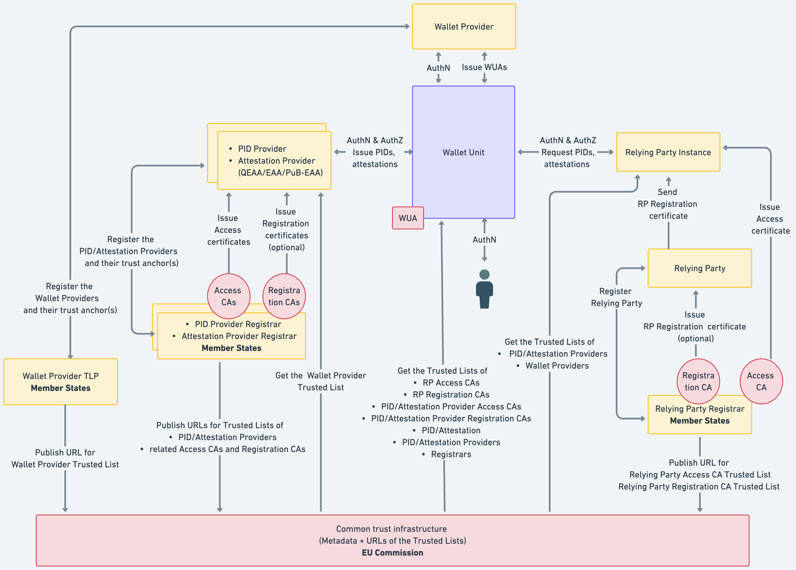

I sandkassen vil Digdir forvalte den nasjonale tillitslista, som vil innehalde kva hovudaktørar som er godkjent som:

- PID-utstedarar
- Lommebok-operatørar
- Kvalifiserte utstedarar (QEAA)
- Offentlige utstedarar (Pub-EAA)
- Ordinære (ikkje-kvalifiserte) utstedarar (EAA)
- Brukerstadsertifikat-utstedarar

<table><tr><td>

graph

subgraph AK [Tillitsliste]
  TLPID@{ shape: docs, label: "PID-utstedere"}
  TLEAA@{ shape: docs, label: "Utstedere (QEAA, PubEAA, EAA)"}
  
  TLRP@{ shape: docs, label: "Tilgangssertifikat-leverandørar"}
  TLW@{ shape: docs, label: "Lommebok-operatører"}

end

  DRPR[(Digdir brukerstad-register)]
  RPR[(Andre brukerstad-registre)]

TLRP --> DRPR
TLRP --> RPR

</td></tr>
<tr><td>
 <em>Tillitsrammeverket i sandkassen</em>
 </td>
</tr>
</table>

Det er verd å merke seg at sjølve brukarstadene (relying parties) ikkje havnar på den sentrale tillitslista, men at det istaden er ein to-nivå struktur: den sentrale tillitslista peikar berre på PKIer forvalta av godkjente **tilgangssertifikat-utstedere**. Det kan gjerne vere fleire slike sertifikat-utstedere i eit land. Eit brukarstad må ta kontakt med ein **Registrar** for å skaffe eit brukerstad-sertifikat (også kjent som "tilgangssertifikat": Relying Party Access Certificate). Normalt vil Registrar og sertifikat-utsteder vere same organisasjon. 

I sandkassen vil Digdir tilby ein Regigstrar-funksjon med tilhøyrande brukarstadsertifikat-utstedar.  Det er opent for at fleire aktørar også kan vere Registrar i sandkassen.

### Teknisk skildring

Teknisk er tilliten mellom aktørane i lommebok-økosystemet primært basert på PKI, dvs. X.509-sertifikat som skal oppfylle visse eigenskapar og kvaliteter.  

Hovedaktørane må ha sine signeringssertifikat publisert på ei tillitsliste, 

Tillitslista er basert på [ETSI-standarden 319 612](https://www.etsi.org/deliver/etsi_ts/119600_119699/119612/02.03.01_60/ts_119612v020301p.pdf) og er i praksis ei XML-fil som lister opp aktørane og tillitstenestene dei leverer:

* Tillitsteneste-leverandør A (TrustServiceProvider)
  * Tillitsteneste A.1 (TSPService)
    * Status (ServiceStatus)
    * Teneste-type (ServiceTypeIdentifier)
    * Signeringssertifikat (DigitalId)
    * Ytterlegare avgrensningar (AdditionalServiceInformation.URI)
  * Tillitsteneste A.2 
* etc...

For døme på ei ekte produksjons-tillistliste kan du sjå på [den norske tillistlista for tilbydarar av kvalifiserte tillitstenester](https://nkom.no/internett/elektronisk-id-og-tillitstjenester/tillitsliste-trusted-list#norges_tillitsliste).  Alle dei 28 tillitslistene i EU/EØS blir lenka opp i "List of Trusted List" (LOTL) som blir drifta av EU-kommisjonen.

Det er myndigheiter i medlemslanda som har tilgang til, og ansvaret for, å publisere desse TSPane på EU si tillitsliste. 

Dersom ei tillitsteneste med tilhøyrande signeringsertifikat ikkje er lagt inn i tillitslista, skal forsøkt på samhandling verte avvist. Det er krav til gjensidig autentisering, slik at ingen kan "hoppe over" denne valideringa. 

### Praksis

Ta kontakt med Digdir for å få eit brukarstad-sertifikat.  

Bruk gjerne innsynstjenesten for å studere kven so er aktørar i sandkassen.

