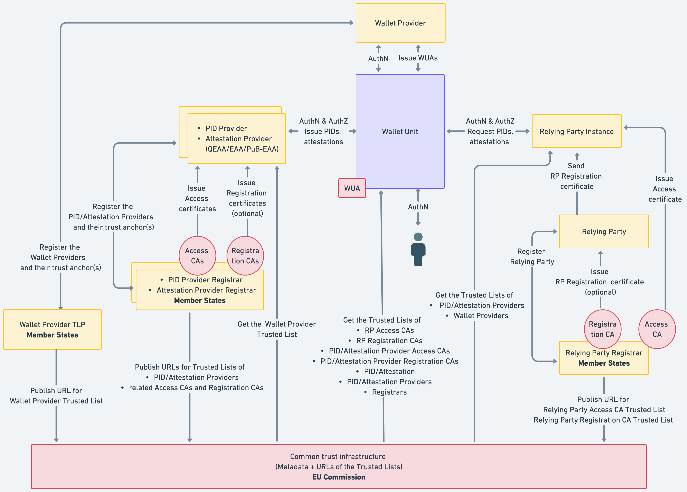

Tillit i sandkassen er basert på tillitslister forvalta av Digdir. Listene fortel kven som er hovudaktørar i sandkassen, kva rolle dei har og kva sertifikat dei brukar.  Du finn tillitslistene her:

- [Tillitsliste for TEST](https://tillitsliste.test.eidas2sandkasse.net/)


Tillitslistene blir bygd basert på registrering i brukerstad-registeret til Digdir. Det er ein manuell prosess for å verte "overført" frå registeret og inn på tillitslistene, som vist i figuren:

<table><tr><td><div class="mermaid">


graph

  RP[(Brukerstad-register)]

  TL@{ shape: docs, label: "Tillitslister"}

RP -- Manuell overføring --> TL


</div></td></tr>
<tr><td>
 <em>Overordna tillitsrammeverk for sandkassen</em>
 </td>
</tr>
</table>

I prinsippet kan det finnast fleire brukarstadsregistre i eit land, men p.t. har sandkassen berre Digdir sitt register.
Arkitekturen er basert på at tenester som du bygger i sandkassen skal bruke tillitslistene for validering, og ikkje brukerstadsregistrene direkte.


## Krav til registering

Alle aktørar i lommebok-økosystemet må vere registrert i eit brukerstadsregister.  Krava finn du i [rettsakt 2025/848](https://eur-lex.europa.eu/legal-content/EN/TXT/?uri=CELEX%3A02025R0848-20260811).  Artikkel 4 set krav til at medlemslandet skal etablere ein policy for registrering.   For sandkassen so gjeld følgjande policy:

- Berre reelle verksemder kan vere registrert som aktør i produksjonsmiljø.
- Verksemda som mottek bevis skal sjølvdeklare kva persondata dei har til hensikt å konsumere.  Digdir gjer ingen kontroll om verksemda har naudsynt heimel til å kunne behandle registrerte data.
- Verksemda som produserer bevis skal sjølvdeklarere kva bevistypar dei har til hensikt å utferde.  Digdir gjer ingen kontroll om verksemda ha heimel til å utferde slike bevis.
- Digdir kontrollerer at verksemder berre registerer roller som stemmer med det dei har oppgitt i sandkasse-avtalen.
- Registrering kan utførast av personar som har anten:
   - a) har ein nøkkelrolle for verksemda (dagleg leiar, styreleiar, etc).
   - b) har rettigheit til å administrere verksemda sin bruk av Digdir nasjonale felleskomponentar
- Registering er sjølvbetjent og basert på innlogging gjennom Ansattporten med privat eID og Altinn Autorisasjon som autoritativ kjelde for representasjon.

For testmiljø gjeld særskild:

- Privatpersonar kan teste som brukerstad, dei må logge inn som seg sjølv, og vil verte tildelt ein syntetisk organisasjonsnummer

Sjå også registreringsprosess for [utsteder](lommebok_taibruk_registrering_utstedar.html) og [brukerstader](lommebok_taibruk_registrering_brukarstad.html).

## Meir om tillitslistene

Det er viktig å vere klar over at tillitslistene er delt opp i to hovudkategoriar:

- **"eIDAS1-lista"** er liste over sokalla tillitstjenester ihht til eIDAS, og desse kan brukast uavhengigeg av lommebok-økosystemet.  Døme på slike tenester er virksomheitssertifikat, signeringstenester eller tidstempling.  Det er viktig å vere klar over at utstedelse av bevis (electronic attestation of attributes) faktisk er definert som ei tillitsteneste, noko som betyr at eit digitalt bevis ikkje MÅ overførast med lommeboka.  I produksjon i Norge idag er det NKOM som pulibserer [den ekte norske eiDAS1-lista](https://nkom.no/files/TSL/NO_TSL.xml).

- **"EUDIW-listene"** gjeld berre for lommebok-økosystemet.   Her vil det vere ei liste per rolle, som lommebok-leverandør, PID-utstedarar, aksesssertifikat-utstedarar, etc.

Dei som brukar lommebok, må difor forhalde seg til fleire lister for å få eit fullt oversikt over kva aktørar som inngår i ulike roller og utføre tilstrekkeleg validering.


graph

subgraph DigReg [Digdirs Registrar]
  DRPR[(Digdir brukerstad-register)]
  CA[Digdir aksesssertifikat-utsteder]
end

subgraph AndreReg [Evt. andre virksomheter]
  RPR[(Evt. andre brukerstad-registre)]
  APR[Evt. andre aksesssertifikt-utstedere]
end

subgraph AK [Tillitslister]

  subgraph E1 ["eIDAS1 (ETSI 119 612)"]

    TLEAA@{ shape: docs, label: "Utstedere (QEAA, PubEAA, EAA)"}
    TLandre@{ shape: docs, label: "Andre tillitstjenester (virk.sertifikater, signering, tidsstempling, ...)"}
     
  end

  subgraph E2 ["EUDIW-lister (ETSI 119 602)"]
  TLPID@{ shape: docs, label: "PID-utstedere"}
  
  TLRP@{ shape: docs, label: "Aksesssertifikat-leverandørar"}
  TLW@{ shape: docs, label: "Lommebok-operatører"}
  end
end


TLRP --> CA


</div></td></tr>
<tr><td>
 <em>Tillitsrammeverket i sandkassen</em>
 </td>
</tr>
</table>

For å verkeleg forstå korleis tillit i lommeboka virkar, anbefalar me å lese avsnitta om "Trust throught a... lifecycle" i [kap 6 i ARFen](https://eudi.dev/latest/architecture-and-reference-framework-main/#6-trust-model).


#### Teknisk skildring


eIDAS1-lista er basert på [ETSI-standarden 119 612](https://www.etsi.org/deliver/etsi_ts/119600_119699/119612/02.03.01_60/ts_119612v020301p.pdf) og er i praksis ei signert XML-fil som lister opp aktørane og tillitstenestene dei leverer.  Denne spec'en støttar liste-av-lister, og i produksjonssmiljøet til slik at EU-kommisjonen har ei sentral tillitsliste som inkluderer alle medlemland.  

*døme på struktur på eidas1-lista*:
```
* Tillitsteneste-leverandør A (TrustServiceProvider)
  * Tillitsteneste A.1 (TSPService)
    * Status (ServiceStatus)
    * Teneste-type (ServiceTypeIdentifier)
    * Signeringssertifikat (DigitalId)
    * Ytterlegare avgrensningar (AdditionalServiceInformation.URI)
  * Tillitsteneste A.2 
* etc...
```

EUDIW-listene er basert på ein nyare spec [ETSI 119 602](https://www.etsi.org/deliver/etsi_ts/119600_119699/119602/01.01.01_60/ts_119602v010101p.pdf) og listene her er signerte JWTer.  Ei mogeleg svakheit med 602 er at den ikkje støtter liste-av-lister, som gjer at ein må finne andre måtar å bygge avgrensa økosystem på tvers av land.

Teknisk er tilliten mellom aktørane i lommebok-økosystemet primært basert på PKI, dvs. X.509-sertifikat som skal oppfylle visse eigenskapar og kvaliteter.  Det er fleire ETSI-spesifikasjonar som set krav til sertifikat-format, policyer etc.





#### Sandkassen

I sandkassen publiserer Digdir både eIDAS1-liste og EUDIW-lister, som då gjeld berre for sandkassen. Vidare opererer me ein Registrar-funksjon med tilhøyrande aksesssertifikat-utstedar.  Det er opent for at fleire aktørar også kan vere Registrar og/eller aksesssertifikat-utsteder om dei ynskjer - ta berre kontakt med oss. 

I den endelege lommebokarkitekturen er det EU-kommisjonen som skal publisere tillistlistene, og so skal medlemslanda melde inn aktørane.  Du kan finne [EU sine tillitslister her](https://eidas.ec.europa.eu/efda/wallet).

Me har eit ynskje om å koble saman andre meldemland sine sandkasser, primært for å understøtte Noreg si deltaking i WeBuild-prosjektet, men p.t. er me usikre på korleis dette faktisk kan realiserast. 


