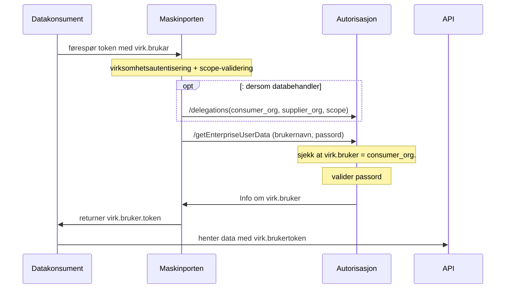
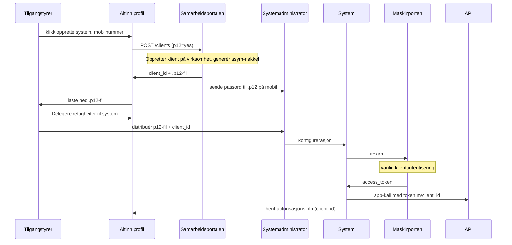
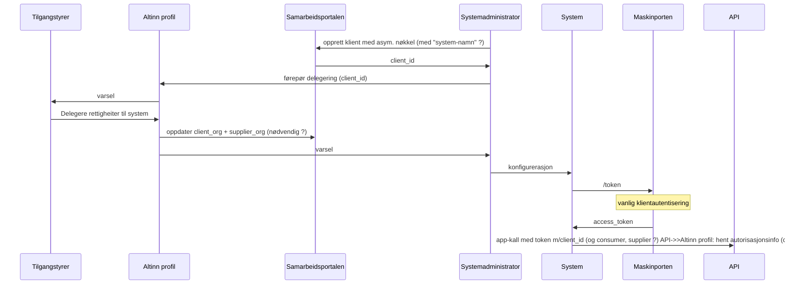

# Samspel Maskinporten og Virksomhetsbrukere


## Alt 1:  Virksomhetsbruker som ny token-type:

Maskinporten vert utvida til å gje ut ein ny type "virksomhetsbruker-token"
* same innhald som dagens tokensutveksling, og det er Autorisasjon som utfører all valideringslogikken for virk.brukaren.



**Request:**

Me nyttar Maskinporten med grunnleggjande JWT-grants på vanleg måte, men innfører RAR sin `authorization_details` som nytt claim i request.

Kun to attributter trengs sendast:  brukarnamn og passord

```
{
  "iss": "<min_clientid>",
  "aud": "https://maskinporten.no/",
  "resource": [ "https://altinn.no", "https://skatteetaten.no" ],
  "scope": "altinn:xxx"                            // i utgangspunktet heilt uavhengig av RAR-tilgangskontrollen.

  "authorization_details": [
    {
      "type":      "altinn:enterpriseuser",        // treng MP tilgangstyre RAR-typen?
      "username":  "sdfkjsskfjlasfsdalfkjsa",
      "password":  ""
    }
  ]

```

**Response**

Ein vanleg maskinporten-token men utvida med ein respons-datamodell tilhøyrande av auth_typen (bestemt av autorisasjon):

```
{
  "iss": "https://maskinporten.no",
  "aud": ["https://altinn.no", "https://skatteetaten.no"]
  "client_id": "<min_clientid>",
  "scope": "altinn:xxx",
  "consumer": {

  }
  "authorization_details": [{
      "type": "altinn:enterpriseuser",
      "org": "brg",
      "orgNumber": 974760673,
      "iss": "https://platform.altinn.cloud/",
      "AuthenticateMethod": "maskinporten",
      "AuthenticationLevel": 3,
   }]
}
```

spm
* er det verkeleg berre org og orgNummer som blir resultatet av ein tokenveksling ifgl doc? (https://docs.altinn.studio/api/scenarios/authentication/#the-altinn-jwt-access-token-output)

ipraksis: vert berre inkludert ein "peikar" i tokenet, som Altinn-API sjølv veit korleis skal autoriserast. Eigentleg ingen fin-korna autorisasjonsinfo i sjølve tokenet.


## Alt 2: Maskinporten-integrasjon erstatter virksomhetsbruker

Her fjernes virksomhetbrukeren (iallefall passordet), og det blir ein 1:1 kobling mellom den "brukeren" som tilgangstyrer forholder seg til i Altinn Profil, og en maskinporten-integrasjon.

Når tilgangstyrer/hovedadministrator/innbygger sjølv er innlogga i Profil, kan vedkommande opprette eit "system" (finn evt. på nytt menneskevenleg namn)
Det blir då oppretta ein ny integrasjon i Samarbeidsportalen, med asymmetrisk nøkkel, knytt til virksomheten, og med Altinn som `supplier`

api-klient = "Person-system"
maskinporten="Maskin-system" ?



* kva rolle fyller dagens virk.bruker.passord - trengs dette når vi har asym. nøkler?
* kva rolle fyller API-KEY - trengs denne ?


### Leverandør-oppretta "virksomhetsbrukere"

Som ovanfor, men systemleveandøren opprette klient (TBD: korleis den skal registrerast, må kanskj utvide MP sin klientmodell?)

Sekvensdiagrammet vert mykje som i førre avsnitt, men startar hjå systemleverandøren (=systemadminostrator)




## Alt 3: Ny nasjonal tillitstjeneste for systemer

Det bør vurderes om mønsteret skal løftast, anten ved å lage ein ny nasjonal fellesløysing for utstedelse av systembrukere, eller om ein skal nøye seg med å forskriftsfeste ein tillitsmodell for slik utstedelse (dvs. ein nasjonal tillitsteneste der dei ulike aktørane kan sjølvdeklarere at dei føl gitte kvalitetskriteria for prosessane i løysinga. Sjølvdeklarerte løysinga må underleggjast tilsyn og kontroll av NKOM)

Som ny fellesløysing, kan ein til dømes ta utgangspunkt i sjølvbetjeninga i Maskinporten kombinert med Felles Datakatalog til å registere systembrukere med identifikatorer og system-nøklar som kan nyttast nasjonalt, mot både offentleg og privat.  Det må lagast ei ttilhøyrande oppslagstjeneste for signering- og krypteringsertifikater for asynkron meldingsutveksling.

Kan også vere ei heilt og ny sjølvstendig teneste, slik som OpenBanking gjer i UK.

Sjå også utdanningssektoren sine innspel til Skate sin høyring om Felles Datakatalog


# vurdering

Alle alternativa medfører at Maskinporten byrjar å utføre, i sambeid med Autorisasjon, fin-granulert tilgangskontroll for Altinn-API og 3jdeparts-API som følger Autorisasjon sin "tilgangsmodell".   Dette er ei arkitekturmessige endring frå dagens bevisste avgrensing til grov-granulert tilgangskontroll.  Kan føre til "formålsutglidning" ?


* få tekniske enderingar
* Autorisasjon må tilby omlag same endepunkt som før
* Skal MP utfører tilgangskontroll på "auth_type" ?
  * dvs. kva klient skal ha lov til å kalle ein spesifikk auth-type.
  * MP må duplisere scope / scope-access funksjonaliteten og etablere sjølvbetjeningsløysinga (må truleg på plass før eller sidan uansett)
* må vurderast: vidareføre "least-priviledge": token-reqest feiler dersom 1 scope eller 1 auth-type manglerdersom 1 av scopa i request feiler, skal då også ALLE auto-details feile?


### Spm:

token-veksling for MP: er det nokon tilfelle der klienten må gjenta
token-veksling for MP: er det tilfelle med "instans-spesifikk-veksling".
Har de tenkt på / sett behov for utvidingar av token-exange-endepunkt?  t.d. ulike ulike responser alt etter mål-API (altinn-app-spesifike token)

### Lenker:

https://altinn.github.io/docs/api/rest/kom-i-gang/virksomhetsbrukere/

https://altinn.github.io/docs/api/rest/kom-i-gang/tutorial-sluttbrukersystem/altinn-token/

Altinn 3:

https://docs.altinn.studio/api/authentication/id-porten/
