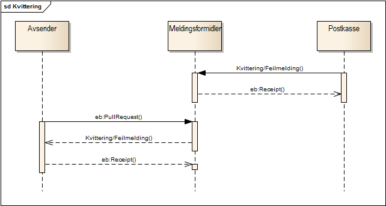

For å indikere statusendring på en melding etter at denne er blitt
levert så skal Postkassen benytte meldinger av typen Kvitteringer.  
Disse blir gjort tilgjengelig for Avsender via Meldingsformidler.
Figuren viser flyten av denne type meldinger.  
Forretningsrelaterte feilsituasjoner[1](#link1) benytter same flyt.

(Meldinger prefikset **eb:** i diagrammet tilhører transportlaget, men
er tatt med for å vise sammenhengen)



| Prosess     | Fra      | Til     | Beskrivelse    |
| --- | --- | --- | --- |
| Kvittering/Feilmelding      | [Postkasse](https://difi.github.io/felleslosninger/sdp_aktorer.html) | [Meldingsformidler](https://difi.github.io/felleslosninger/sdp_aktorer.html) | Kvitteringene som sendes er: [Leveringskvittering](https://difi.github.io/felleslosninger/sdp_leveringskvittering.html), [Åpningskvittering](https://difi.github.io/felleslosninger/sdp_aapningskvittering.html) , [VarslingfeiletKvittering](https://difi.github.io/felleslosninger/sdp_varslingfeiletkvittering.html), i tillegg finnes det en kvittering for feilmeldinger.
| Hent Kvittering/Feilmelding | [Avsender](https://difi.github.io/felleslosninger/sdp_aktorer.html)  | [Meldingsformidler](https://difi.github.io/felleslosninger/sdp_aktorer.html) | Kvittering/Feilmelding ligger tilgjengelig på en kø hos Meldingsformidler. Avsender sender en forespørsel om å hente en kvittering. Meldingsformidler vil levere neste kvittering i køen uavhengig av hvilken kvitteringstype som ligger i køen. Det er en egen kø for prioriterte meldinger. |

### Henting av kvitteringer i parallel

Meldingsformidler støtter at Avsender kan hente kvitteringer i
parallel.  
Meldingformidler gjør kvitteringer som hentes utilgjengelig i 5 minutter
i påvente av en eb:Reciept().

Avsender kan hente kvitteringer fra flere tråder uten vesentlig risiko
for race conditions mellom trådene (man unngår at trådene jobber på
samme kvittering).  
Dette har også en fordel i feilsituasjoner hos avsender (intern feil for
en gitt forsendelse), da den ikke vil lage en “propp” i MPCen til
avsenderen som gjør at avsenderen aldri klarer å motta kvitteringer for
påfølgende forsendelser  
– og i verste fall ender opp med å iverksette alternativ håndtering av
disse brevene fordi det aldri blir mottatt transportkvittering.

### Kvittere på mottatt kvittering og hente neste kvittering samtidig

ebMS 3.0 standarden og også meldingsformdiler støtter at en Avsender kan
bekrefte (eb:Reciept) forrige kvittering på neste forespørsel
(eb:PullRequest).  
Dette reduserer antall transportmeldinger i forbindelse med hente
kvitteringer og effektiviserer dermed prosessen.

I java klienten for sikker digital post gjøres dette slik:

``` brush: bash; toolbar: false
  SikkerDigitalPostKlient.hentKvitteringOgBekreftForrige(kvitteringForespoersel, forrigeKvittering)
```
<a name="link1"></a>
1.  Dette er feilsituasjoner som vil kreve manuell oppfølging fra
    Avsender og av en art som ikke lar seg løse automatisk. Typisk
    eksempel kan være at Mottaker har skiftet postboks, og at meldingen
    er feilsendt.
