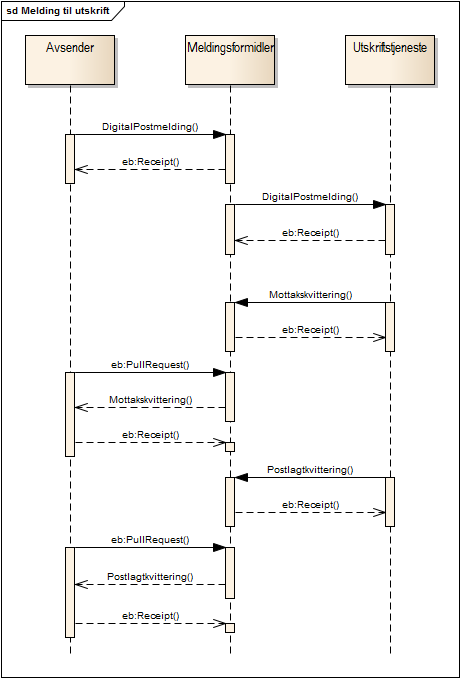

---

title: Sending av post til utskrift og forsendelse 
permalink: sdp_forretningsprosess_utskrift.html
sidebar: dpi_sidebar
---

## Prosess for sending av papir post

[Meldingen](../meldinger/) i Sikker digital post flyter mellom
[Aktørene](Aktorer.md) slik det beskrives i flytdiagrammet under.

Ovordnet er meldingsflyten slik:

1.  Avsender[1](#link1) sender en [Digital
    postmelding](../meldinger/DigitalPostMelding.md) via Meldingsformidler
    til Utskriftstjeneste
2.  Postkasse sender en eller fler
    [Kvitteringsmeldinger](../meldinger/KvitteringsMelding.md) til
    Meldingsformidler
3.  Avsender henter
    [Kvitteringsmeldinger](../meldinger/KvitteringsMelding.md) fra
    Meldingsformidler

(Meldinger prefikset **eb:** i diagrammet tilhører transportlaget, men
er tatt med for å vise sammenhengen)

| Prosess    | Fra     | Til      | Beskrivelse         |
| --- | --- | --- | --- |
| [DigitalPostmelding](../meldinger/DigitalPostMelding.md)         | [Avsender](Aktorer.md)          | [Meldingsformidler](Aktorer.md) | Avsender sender alltid sine meldinger til meldingsformidler. Transportkvittering fra meldingsformidler indikerer at denne har tatt over ansvaret for videre formidling av meldingen |
| DigitalPostmelding                                            | [Meldingsformidler](Aktorer.md) | [Utskriftstjeneste](Aktorer.md) | Meldingsformidler mellomlagrer meldingen inntil Utskriftstjeneste har returnert en transportkvittering.                                                                             |
| [MottaksKvittering](../meldinger/MottaksKvittering.md) [2](#link2)     | [Utskriftstjeneste](Aktorer.md) | [Meldingsformidler](Aktorer.md) | Utskriftstjeneste sender en [MottaksKvittering](../meldinger/MottaksKvittering) for å signalisere at utskriftstjenesten har mottatt og lagt meldingen klar til behandling.          |
| [LeveringsKvittering](../meldinger/LeveringsKvittering.md) [3](#link3) | [Utskriftstjeneste](Aktorer.md) | [Meldingsformidler](Aktorer.md) | Utskriftstjeneste sender en [LeveringsKvittering](../meldinger/LeveringsKvittering) for å signalisere at posten er skrevet ut, konvolutert og postlagt.                             |
| [ReturpostKvittering](../meldinger/ReturpostKvittering.md) [4](#link4) | [Utskriftstjeneste](Aktorer.md) | [Meldingsformidler](Aktorer.md) | Utskriftstjeneste sender en [ReturpostKvittering](../meldinger/ReturpostKvittering.md) for å signalisere at posten har kommet tilbake og ikke kan leveres til innbygger.               |
| HentKvittering                                                | [Avsender](Aktorer.md)          | [Meldingsformidler](Aktorer.md) | Avsender sender forespørsel til Meldingsformidler om å få levert ventende kvitteringer[5](#link5)                                                                                        |

1.  Avsender bør også ha et aktivt forhold til statusen til en melding.
    Meldingsflytdiagrammet kan med fordel ses i sammenheng med
    [tilstandsdiagrammet](avsender_tilstanddiagram.md) for sikker digital
    post.

2.  [Mottakskvittering](../meldinger/MottaksKvittering.md) sendes så fort
    utskriftstjenesten har mottatt
    [DigitalPostmelding](../meldinger/DigitalPostMelding.md) og lagt den i
    kø for utskrift. Altså kort tid etter at
    [DigitalPostmelding](../meldinger/DigitalPostMelding.md) er sendt.

3.  Utskriftstjenesten samler sammen alle utskrifter til en
    utskriftsjobb hver dag. Når dette er fullført og posten er postlagt
    vil utskriftstjenesten sende over
    [LeveringsKvittering](../meldinger/LeveringsKvittering.md). Disse vil
    dermed komme tilbake i daglige puljer til Avsender.

4.  [ReturPostkvittering](../meldinger/ReturpostKvittering.md) blir kun
    dersom returpost håndtering er bestilt i
    [DigitalPostmelding](../meldinger/DigitalPostMelding.md). Returpost som
    er fysisk ødelagt slik at ikke posten kan identifiseres vil bli
    levert til returadressen oppgitt så lenge denne er leselig.

5.  Dette kan være alle typer kvitteringer, ikke bare Mottakskvitter og
    LeveringsKvittering
