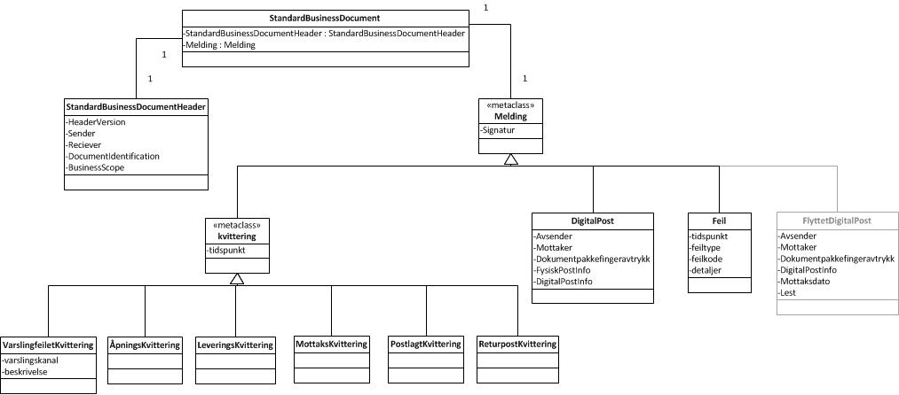

---

title: Forretningsmeldinger  
permalink: sdp_index.html
sidebar: sidebar_begrep
---

## Forretningsmeldingene i Sikker Digital Post

Alle meldinger er beskrevet i [Standard Business
Document](https://difi.github.io/felleslosninger/standardbusinessdocument_index.htmll). Denne klassen
inneholder to klasser:

  - Det ene er
    [StandardBusinessDocumentHeader](https://difi.github.io/felleslosninger/sdp_standardbusinessdocumentheader.html)
    som er felles for alle meldinger. 
  - Den andre er Meldingsklassen som enten er av typen Digitalpost, Feil
    eller Kvittering. Kvittering kan være av typen
    VarslingfeiletKvittering, Åpningskvittering eller
    LeveringsKvittering.

### Klassediagram

Meldingen er en av følgende typer beskrevet i diagrammet under.

### Meldingstypene

Meldingstypen er definert i
[DocumentIdentification](https://difi.github.io/felleslosninger/sdp_documentidentification.html )
og er en av følgende:

| Type | Beskrivelse |
| --- | --- |
| [Digitalpost](DigitalPostMelding.md) | Forsendelse av digital post |
| [LeveringsKvittering](LeveringsKvittering.md) | Kvittering på at digital post er tilgjengeliggjort eller at en fysisk post er postlagt |
| [ÅpningsKvittering](AapningsKvittering.md) | Kvittering fra Innbygger for at digital post er åpnet |
| [Varslingfeilet](VarslingfeiletKvittering.md) | Kvittering for at en spesifisert varsling ikke har blitt sendt |
| [MottaksKvittering](MottaksKvittering.md) | Kvittering fra utskrift og forsendelsestjenesten om at melding er mottatt og lagt til print |
| [ReturpostKvittering](ReturpostKvittering.md) | Kvittering fra utskrift og forsendelsestjenesten om at posten ikke har blitt levert til Mottaker. |
| [Feil](Feil.md) | Generell melding om at det har skjedd en feil. |
| [FlyttetDigitalpost](FlyttetDigitalPostMelding.md) | For flytting av post fra en postkasse til en annen. Brukes kun i mellom postkasseleverandørene |

### Felles meldingsatributt

Alle meldingene består av et felles attributt uavhengig av
meldingstypen.  
Resten av attributtene er definert i de enkelte meldingstypene, se over.

| Identifikator | Kardinalitet | Datatype |
| --- | --- | --- |
| Signature | 1..1 | [ds:Signature](https://www.oasis-open.org/committees/download.php/21256/wss-v1.1-spec-errata-os-SOAPMessageSecurity.htm#_Toc118717148), Enveloped XML signatur |

### krav til signaturen

Det er satt følgende krav til signaturen av forretningsmeldingene:

  - Security Token være X509 sertifikater 
  - Sertifikatet som brukes skal være et virksomhetssertifikat
  - Sertifikat for validering av signatur skal inkluderes i Signatur
    elementet
  - Signeringsalgoritmen skal være
    <http://www.w3.org/2001/04/xmldsig-more#rsa-sha256>. 
  - Fingeravtrykksalgoritmen i referansene skal være
    <http://www.w3.org/2001/04/xmlenc#sha256>
  - Signature skal være en signatur av Meldingen og signatur av
    [StandardBusinessDocumentHeader](../forretningslag/StandardBusinessDocument/StandardBusinessDocumentHeader.md).
  - BØR være signert av
    [Behandlingsansvarlig](../forretningslag/Aktorer.md), men KAN signeres
    av [Databehandler](../forretningslag/Aktorer.md).
